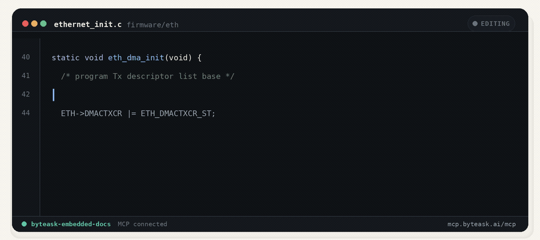

<div align="center">

# ByteAsk Embedded MCP

**Page-cited answers from embedded & firmware reference docs — for coding agents that can't afford to guess a register value.**

[](https://smithery.ai/servers/kulkarnianirudha8/byteaskai)
[](LICENSE)
[](pyproject.toml)
[](https://modelcontextprotocol.io)
[](#)
[](#contributing)
[](https://docs.byteask.ai/embedded)

Official MCP Registry Namespace: `ai.byteask/embedded-docs` · Remote MCP Endpoint: `https://mcp.byteask.ai/mcp`

[Quickstart](#quickstart) · [Tools](#tools) · [Connect a client](#connect-a-client) · [Configuration](#configuration) · [Hosted server](#hosted-server) · [Contributing](#contributing)



</div>

---

ByteAsk Embedded MCP is the open-source server behind [ByteAsk Embedded Docs](https://docs.byteask.ai/embedded):
a **source-grounded, page-cited evidence-retrieval** MCP server for coding agents
(Claude Code, Codex, Cursor) that write firmware / driver / protocol code and need
*exact* facts — SunSpec points, register offsets, Modbus function codes, trip
thresholds, SCPI commands, API symbols.

It returns **verbatim snippets with page citations** — never an authored answer — and
when nothing is relevant enough it says **no match** rather than fabricate. Every
document is treated equally: no authority layer, no filters.

> [!NOTE]
> **What's in this repo:** the MCP *server* — tools, transports (stdio + Streamable
> HTTP), bearer auth, DNS-rebinding protection, result rendering — plus a small,
> pluggable retrieval interface.
>
> **What's _not_ in this repo:** the retrieval engine and the document corpus. How
> documents are parsed, chunked, embedded, and ranked, and the licensed source
> material itself, sit behind the [`SearchBackend`](src/byteask_embedded_mcp/backend.py)
> seam and power the hosted endpoint at `https://mcp.byteask.ai/mcp`. This repo ships
> an in-memory [`SampleBackend`](src/byteask_embedded_mcp/backend.py) (a few
> illustrative, public-knowledge records) so the server runs out of the box.

## Why

- **Cited, or nothing.** Every hit is verbatim source text with a section + page
  citation. On a miss it returns an honest "no confident match" — it never invents a
  register value.
- **Built for coding agents.** The tool descriptions and triggers are tuned so agents
  call `search_docs` reflexively the moment they see a hex literal, a Modbus code, an
  IEEE clause, a SCPI verb, or an MCU part number — before answering from memory.
- **Two transports, one server.** `stdio` for local agents, Streamable HTTP for hosted.
- **Bring your own retrieval.** The search engine is a two-method interface — swap in
  anything behind `BYTEASK_BACKEND` without touching the server.
- **Zero-setup demo.** The bundled `SampleBackend` runs immediately. No API keys.

## Quickstart

Requires Python ≥ 3.10 and [`uv`](https://docs.astral.sh/uv/).

```bash
uv sync
uv run byteask-embedded-mcp        # run as an MCP server (stdio)
```

That's it — the bundled `SampleBackend` serves a couple of illustrative records, so
`search_docs` works immediately. Run the offline tests with `uv run pytest`.

## Connect a client

### Hosted (no install)

The hosted server speaks **Streamable HTTP** at `https://mcp.byteask.ai/mcp` and is
backed by the full licensed corpus.

[](https://cursor.com/install-mcp?name=byteask-embedded-docs&config=eyJ1cmwiOiJodHRwczovL21jcC5ieXRlYXNrLmFpL21jcCJ9)

**Claude Code:**

```bash
claude mcp add --transport http byteask-embedded-docs https://mcp.byteask.ai/mcp
```

<details>
<summary><strong>Codex, Cursor, and other clients (mcp-remote)</strong></summary>

```json
{
  "mcpServers": {
    "byteask-embedded-docs": {
      "command": "npx",
      "args": ["-y", "mcp-remote", "https://mcp.byteask.ai/mcp"]
    }
  }
}
```

</details>

### Local (this repo)

The project-scoped [`.mcp.json`](.mcp.json) registers the stdio server for clients
that read it. Manually, for Claude Code:

```bash
claude mcp add byteask-embedded-docs -- uv run byteask-embedded-mcp
```

## Tools

Input is natural language (or an exact identifier). Output is compact markdown.

| Tool | What it does |
|------|--------------|
| **`search_docs(query, limit=8)`** | Search the corpus; return ranked, page-cited evidence. Each hit has a document title, a section + page citation, the verbatim snippet, and a `result_id`. A "no confident match" response means *not found — do not fabricate*. |
| **`get_context(result_id)`** | Expand a hit to its full source section. |
| **`request_document(request)`** | Ask for a missing document to be added (logged server-side). |

Example output:

```markdown
## Results for "what Modbus function code writes multiple registers"

### Sample — Modbus Application Protocol (illustrative) — §6.12, p.30
> Function code 16 (0x10), Write Multiple Registers, writes a block of contiguous
> holding registers (1 to 123 registers) in a remote device. ...
_ref: sample:modbus-fc16_
```

## Plug in your own retrieval

The server depends only on a two-method interface
([`backend.py`](src/byteask_embedded_mcp/backend.py)):

```python
class SearchBackend(Protocol):
    def search(self, query, limit=8, effort=None) -> dict: ...
    def get_context(self, result_id, effort=None) -> dict: ...
```

Implement it, expose a factory `make_backend(config) -> SearchBackend`, and point the
server at it:

```bash
BYTEASK_BACKEND="my_pkg.my_module:make_backend"
```

The exact return-value contracts are documented at the top of `backend.py`.

## Configuration

All settings are environment variables (loaded from `.env`; see [`.env.example`](.env.example)).

| Variable | Default | Notes |
|----------|---------|-------|
| `BYTEASK_BACKEND` | — | `module:callable` returning a `SearchBackend`; empty → `SampleBackend` |
| `BYTEASK_LOGS` | `logs` | where query / request JSONL logs are written |
| `MCP_TRANSPORT` | `stdio` | `stdio` (local agents) or `http` |
| `MCP_HTTP_HOST` / `MCP_HTTP_PORT` | `127.0.0.1` / `8000` | HTTP bind address |
| `MCP_HTTP_AUTH_TOKEN` | — | bearer token for HTTP (empty = unauthenticated, dev only) |
| `MCP_ALLOWED_HOSTS` | — | comma-separated hosts allowed in the `Host` header (`*` disables) |
| `LOG_LEVEL` | `INFO` | stderr log verbosity |

<details>
<summary><strong>Running over HTTP</strong></summary>

```bash
MCP_TRANSPORT=http MCP_HTTP_AUTH_TOKEN=$(openssl rand -hex 32) \
  uv run byteask-embedded-mcp --host 0.0.0.0 --port 8000
```

Clients then send `Authorization: Bearer <token>`. The bundled bearer check is a
shared-secret **stub** — replace it with real auth (OAuth 2.1 resource server, mTLS,
or a trusted reverse proxy) before exposing publicly. DNS-rebinding protection stays
on independently via `MCP_ALLOWED_HOSTS`.

</details>

## Hosted server

You don't need to run anything to use ByteAsk Embedded Docs. The hosted server gives
Claude Code, Codex, Cursor, and any MCP client exact, page-cited facts from embedded
and firmware reference docs — register maps, protocol function codes, SCPI commands,
standard thresholds, datasheet specs. The guarantee: *verbatim source, or "no match" —
never an invented value.*

| | |
|---|---|
| **Name** | `byteask-embedded-docs` |
| **Endpoint** | `https://mcp.byteask.ai/mcp` (Streamable HTTP) |
| **Docs & per-client setup** | <https://docs.byteask.ai/embedded> |

This repository is the open-source server that powers that endpoint.

## Project layout

```
src/byteask_embedded_mcp/
  server.py     # FastMCP app + 3 tools (search_docs, get_context, request_document)
  backend.py    # SearchBackend protocol + in-memory SampleBackend (swap for real retrieval)
  render.py     # structured result -> compact markdown
  http_auth.py  # Streamable HTTP entrypoint + stub bearer-token guard
  config.py     # server config (transport, logging, backend selection)
  schemas.py    # Hit / Section result types
  obs.py        # per-call JSONL logging
tests/          # offline unit tests (renderer, backend, server tools)
assets/         # README demo GIF + its deterministic generator
```

## Security

- **stdout stays clean** in stdio mode (it is the JSON-RPC channel); all logs go to
  stderr / `logs/*.jsonl`.
- The HTTP **bearer check is a stub** — unauthenticated if no token is set, a shared
  secret at best. Harden it before exposing widely.
- **DNS-rebinding protection** is on by default for the HTTP transport.

## Contributing

PRs and issues are welcome.

```bash
uv sync            # install (incl. dev tools)
uv run pytest      # run the offline test suite
```

A few conventions to keep the server clean:

- **The backend seam is the extension point.** Retrieval internals (parsing, chunking,
  embeddings, ranking) are intentionally out of scope here — build them behind
  `SearchBackend` in your own package, not in this repo.
- **Keep the dependency surface small** and the stdio path free of the HTTP stack.
- **Add a test** for new behavior; the suite is fully offline (no network, no keys).

## License

[MIT](LICENSE) © ByteAsk
